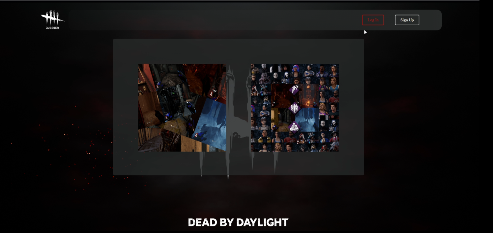
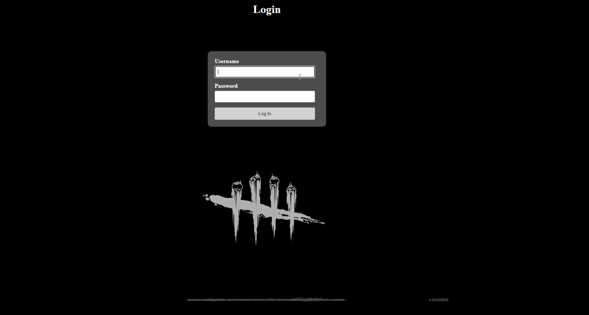
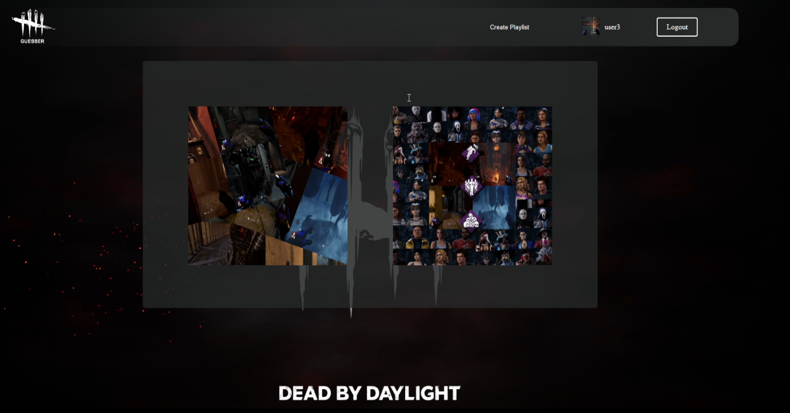
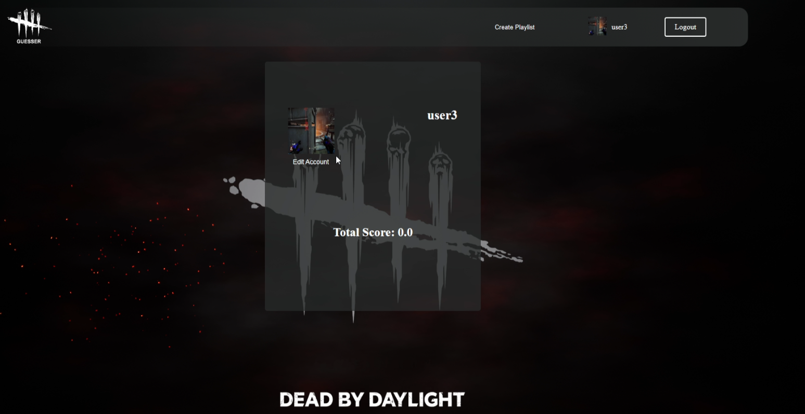
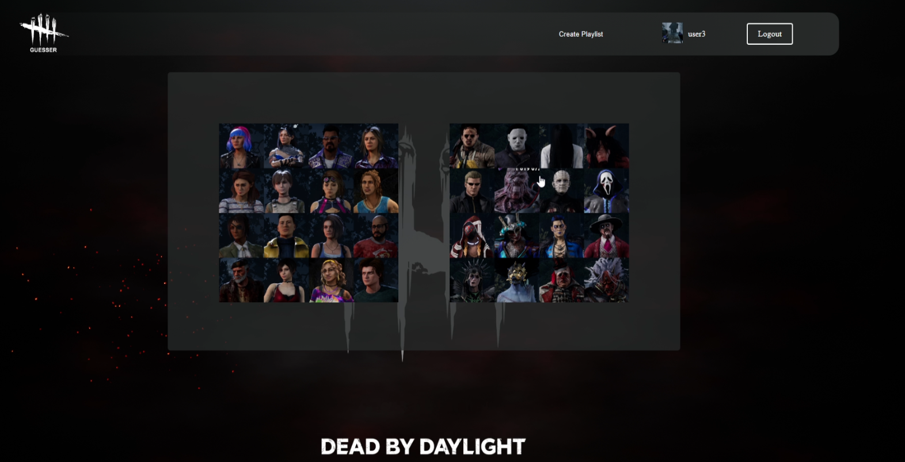
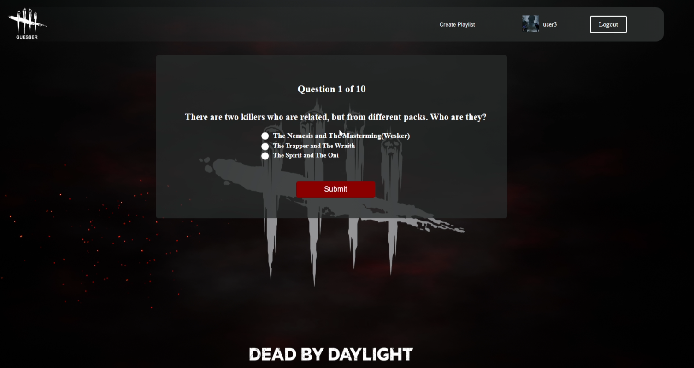
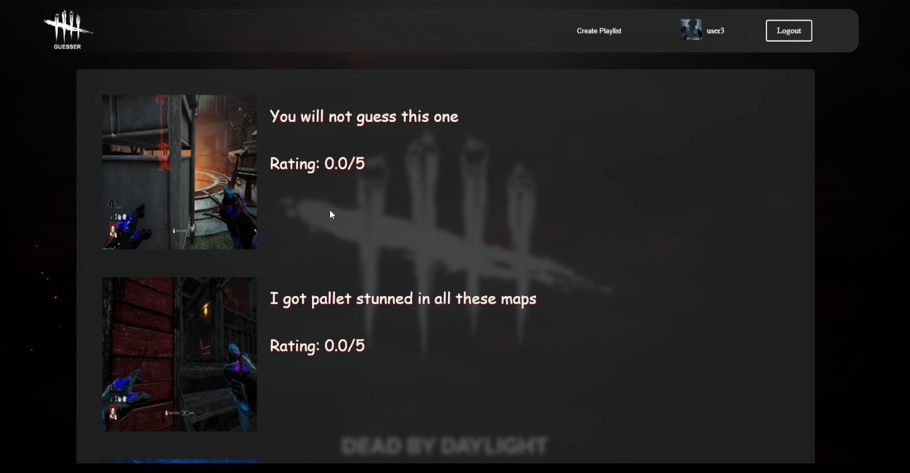
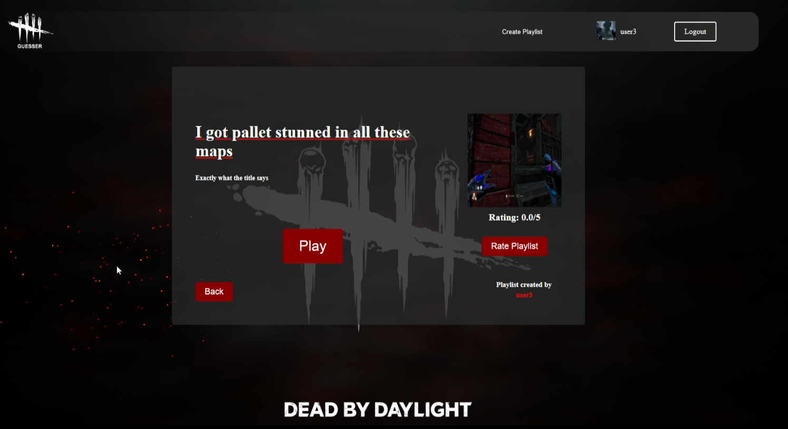
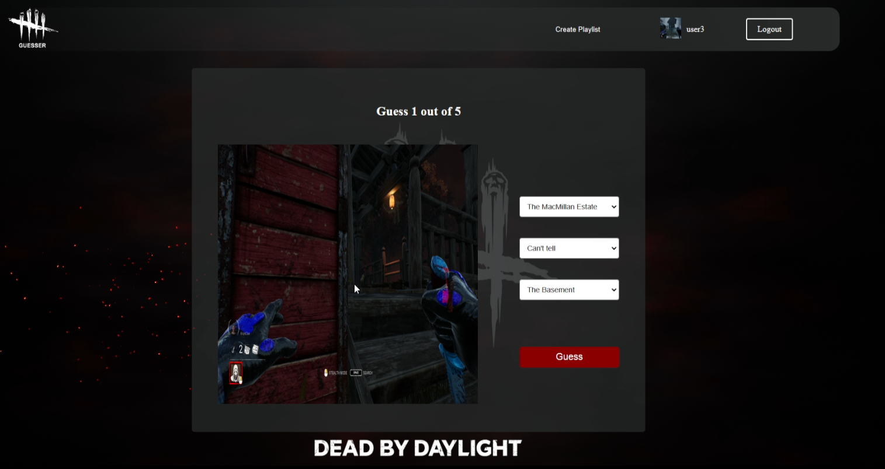

# DBD Geoguesser
## Introduction
DBD Geoguesser is a web application inspired by the popular games Dead by Daylight and GeoGuessr. This project combines the horror and thrill elements of Dead by Daylight with the geographical guessing challenges of GeoGuessr. Players are presented with various in-game locations from the maps of Dead by Daylight, and they must guess their in-game locations from the specific area to the name of the realm and the variation of it.

## Features
Playlist-Based Gameplay: Players choose from different playlists featuring screenshots from the game and guess where they were taken.
User and Creator Roles: Users can play the game, while creators can create new playlists for others to play.
Account Management: Users can change their account details.
Trivia Game Mode: An additional game mode where players answer trivia questions based on playlists.

## Technologies Used
Spring Boot: Backend framework.
Thymeleaf: Templating engine for rendering HTML.
Java: Core programming language.
HTML/CSS: For structuring and styling the web pages.
JavaScript: For interactive elements.
MySQL: Local database for storing user data, playlists, and scores.
Maven: For project management and build automation.

## Usage
Access the application: Open a web browser and navigate to http://localhost:8080. Login or create an account.
Start a game: Choose the type of game you want to play, trivia or guesser. Choose the playlist you want to play.
Submit your guess: Choose from the dropdown menus of each image the specific the realm, the variation and the specific tile within a map.
View your score: The score will be shown at the end.

## Demo

